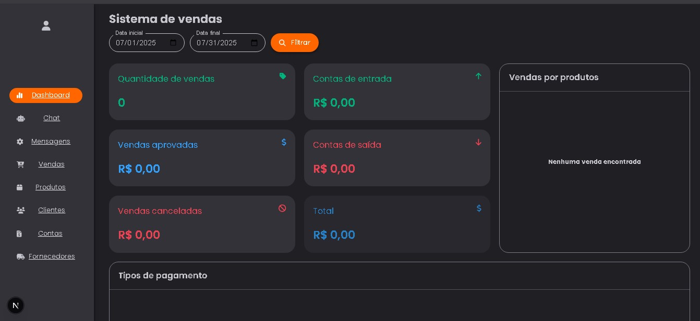

O Chatbot no Backend é flexível para integração com qualquer plataforma (Whatsapp, Telegram etc).

# Venda aí, bot!

## Sistema de vendas com Chatbot integrado.



- **Descrição do Projeto**: O Vendaí Bot é um sistema de vendas com painel completo e chatbot integrado. Por meio do chatbot, o cliente pode fazer pedidos, consultar o cardápio, ver a taxa de entrega ou falar com um atendente. Os pedidos realizados são enviados automaticamente para a API, que registra a compra e a exibe na aba de vendas do sistema em tempo real.

# Tópicos do README
- *Tecnologias Utilizadas*
- *Visão Geral*
- *Funcionalidades*
- *Como utilizar Localmente*

## Tecnologias Utilizadas
- **Node.js v20.16.0**
- **TypeScript**
- **MongoDB**
- **Express.js**
- **React**
- **Next.js**

## Visão Geral

## ⚙️ Funcionalidades

### 🖥️ Painel Administrativo
- Dashboard com resumo de vendas (aprovadas, canceladas, total e quantidade).
- Gráficos de produtos mais vendidos.
- Filtros por período (data inicial/final).
- Visualização de contas de entrada e saída.
- Seções dedicadas para clientes, produtos, vendas, mensagens e fornecedores.

### 💬 Chatbot de Autoatendimento
- Interface simples e direta para o cliente realizar pedidos.
- Exibe lista dos produtos cadastrados e o preço.
- Permite consultar taxa de entrega e falar com atendente humano.
- Ao finalizar o pedido, os dados são enviados para a API e registrados automaticamente na aba de **Vendas**.

## Como utilizar Localmente
- **Descrição**: Instale as dependências "`npm run setup`" e utilize "`npm run start`" para iniciar o Front-End *(localhost:3000)* e o Back-End *(localhost:9999)* ao mesmo tempo com a lib de desenvolvimento "`concurrently`".

```bash
git clone https://github.com/Everton-Lourens/vendai-bot.git
cd vendai-bot
npm run setup
npm run start
```

### Endpoint Front-End
`GET - http://localhost:3000`

### Endpoint Back-End
`POST - http://localhost:9999/chat/chatbot`
